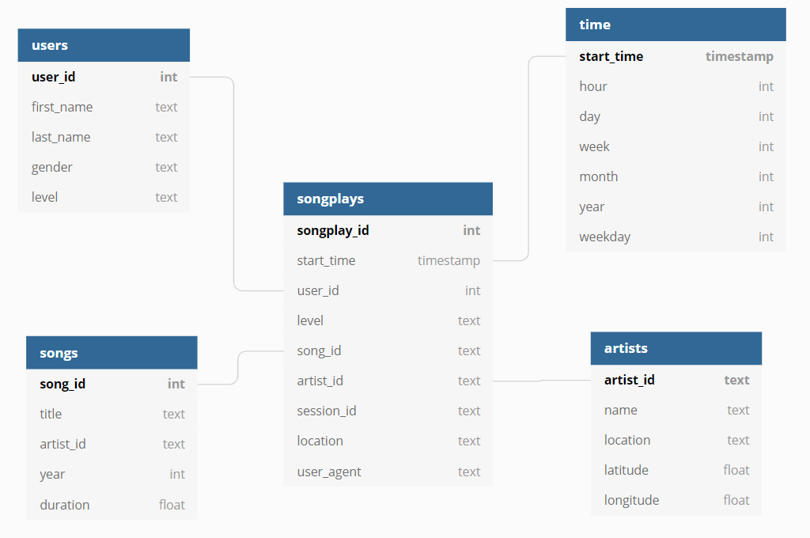

# Sparkify Music Data Lake with Spark

## Contents

1. [Introduction](#Introduction)
2. [Project Description](#motivation)
3. [Source Data](#Datasets)
4. [Schema](#Schema)
5. [Scripts](#Scripts)
6. [Getting Started](#Started)

## Introduction<a name="installation"></a>

A startup Sparkify Music wants to analyze the data they've been collecting on songs and user activity on their new music streaming app. The analytics team is particularly interested in understanding what songs users are listening to. Currently, they don't have an easy way to query their data, which resides in a directory of JSON logs on user activity on the app, as well as a directory with JSON metadata on the songs in their app.

## Project Description<a name="motivation"></a>

This project is to build an ETL pipeline for a data lake hosted on AWS S3. First, we define fact and dimension tables for a star schema for a particular analytic focus, then write an ETL pipeline that load raw data from S3, create schema tables, then load the tables back into personal S3.

## Source Data <a name="Datasets"></a>

### Song Dataset

The first dataset, located in s3://udacity-dend/song_data, is a subset of real data from the [Million Song Dataset](http://millionsongdataset.com/). Each file is in JSON format and contains metadata about a song and the artist of that song. The files are partitioned by the first three letters of each song's track ID. For example, here are filepaths to two files in this dataset.

`song_data/A/B/C/TRABCEI128F424C983.json`</br>
`song_data/A/A/B/TRAABJL12903CDCF1A.json`

And below is an example of what a single song file, TRAABJL12903CDCF1A.json, looks like.

```json
{"num_songs": 1, "artist_id": "ARJIE2Y1187B994AB7", "artist_latitude": null, "artist_longitude": null, "artist_location": "", "artist_name": "Line Renaud", "song_id": "SOUPIRU12A6D4FA1E1", "title": "Der Kleine Dompfaff", "duration": 152.92036, "year": 0}
```

### Log Dataset

The second dataset, located in s3://udacity-dend/log_data, consists of log files in JSON format generated by this [event simulator](https://github.com/Interana/eventsim) based on the songs in the dataset above. These simulate activity logs from a music streaming app based on specified configurations.

The log files are partitioned by year and month. For example, here are filepaths to two files in this dataset.

`log_data/2018/11/2018-11-12-events.json`</br>
`log_data/2018/11/2018-11-13-events.json`


And below is an example of what the data in a log file, 2018-11-12-events.json, looks like.


## Schema <a name="Schema"></a>

### Fact Table
1. **songplays** - Records in log data associated with song plays i.e. records with page NextSong.</br>
songplay_id, start_time, user_id, level, song_id, artist_id, session_id, location, user_agent

### Dimension Tables
2. **users** - Users in the app.</br>
user_id, first_name, last_name, gender, level

3. **songs** - Songs in music database.</br>
song_id, title, artist_id, year, duration

4. **artists** - Artists in music database.</br>
artist_id, name, location, latitude, longitude

5. **time** - Timestamps of records in songplays broken down into specific units.</br>
start_time, hour, day, week, month, year, weekday



## Scripts <a name="Scripts"></a>

- **etl.py** - Reads and processes all song datasets and log datasets, then loads into S3.</br>
               To facilitate testing the program, there are two options (Select Y or N) before starting Spark session:</br>
               Load data from Udacity S3 (Y) or load test data from local directory (N)? </br>
               Write data into my S3 (Y) or write into local directory (N)? </br>

## Getting Started <a name="Started"></a>

`python etl.py`